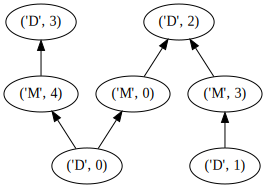

# Quickstart

## Preliminaries

### Imports


```python
import mercs
import numpy as np
from mercs.tests import load_iris, default_dataset
from mercs.core import Mercs

import pandas as pd
```

## Fit

Here a small MERCS testdrive for what I suppose you'll need. First, let us generate a basic dataset. Some utility-functions are integrated in MERCS so that goes like this


```python
train, test = default_dataset(n_features=3)

df = pd.DataFrame(train)
df.head()
```


<div>
<style scoped>
    .dataframe tbody tr th:only-of-type {
        vertical-align: middle;
    }

    .dataframe tbody tr th {
        vertical-align: top;
    }

    .dataframe thead th {
        text-align: right;
    }
</style>
<table border="1" class="dataframe">
  <thead>
    <tr style="text-align: right;">
      <th></th>
      <th>0</th>
      <th>1</th>
      <th>2</th>
      <th>3</th>
    </tr>
  </thead>
  <tbody>
    <tr>
      <th>0</th>
      <td>-0.878999</td>
      <td>0.372105</td>
      <td>-0.177663</td>
      <td>0.0</td>
    </tr>
    <tr>
      <th>1</th>
      <td>-1.007950</td>
      <td>-0.196467</td>
      <td>-1.271123</td>
      <td>1.0</td>
    </tr>
    <tr>
      <th>2</th>
      <td>0.343341</td>
      <td>0.209659</td>
      <td>-0.446280</td>
      <td>0.0</td>
    </tr>
    <tr>
      <th>3</th>
      <td>-2.361662</td>
      <td>-0.600424</td>
      <td>-1.301522</td>
      <td>0.0</td>
    </tr>
    <tr>
      <th>4</th>
      <td>-2.123507</td>
      <td>0.246505</td>
      <td>-1.323388</td>
      <td>0.0</td>
    </tr>
  </tbody>
</table>
</div>


```python
df.describe()
```


<div>
<style scoped>
    .dataframe tbody tr th:only-of-type {
        vertical-align: middle;
    }

    .dataframe tbody tr th {
        vertical-align: top;
    }

    .dataframe thead th {
        text-align: right;
    }
</style>
<table border="1" class="dataframe">
  <thead>
    <tr style="text-align: right;">
      <th></th>
      <th>0</th>
      <th>1</th>
      <th>2</th>
      <th>3</th>
    </tr>
  </thead>
  <tbody>
    <tr>
      <th>count</th>
      <td>800.000000</td>
      <td>800.000000</td>
      <td>800.000000</td>
      <td>800.000000</td>
    </tr>
    <tr>
      <th>mean</th>
      <td>-0.026556</td>
      <td>0.023105</td>
      <td>-0.032320</td>
      <td>0.495000</td>
    </tr>
    <tr>
      <th>std</th>
      <td>1.414683</td>
      <td>0.982609</td>
      <td>1.351052</td>
      <td>0.500288</td>
    </tr>
    <tr>
      <th>min</th>
      <td>-4.543441</td>
      <td>-3.019512</td>
      <td>-3.836929</td>
      <td>0.000000</td>
    </tr>
    <tr>
      <th>25%</th>
      <td>-1.074982</td>
      <td>-0.629842</td>
      <td>-1.040769</td>
      <td>0.000000</td>
    </tr>
    <tr>
      <th>50%</th>
      <td>-0.237825</td>
      <td>0.000368</td>
      <td>-0.180885</td>
      <td>0.000000</td>
    </tr>
    <tr>
      <th>75%</th>
      <td>0.972748</td>
      <td>0.668419</td>
      <td>1.005200</td>
      <td>1.000000</td>
    </tr>
    <tr>
      <th>max</th>
      <td>4.020262</td>
      <td>3.926238</td>
      <td>3.994644</td>
      <td>1.000000</td>
    </tr>
  </tbody>
</table>
</div>


Now let's train a MERCS model. To know what options you have, come talk to me or dig in the code. For induction, `nb_targets` and `nb_iterations` matter most. Number of targets speaks for itself, number of iterations manages the amount of trees _for each target_. With `n_jobs` you can do multi-core learning (with joblib, really basic, but works fine on single machine), that makes stuff faster. `fraction_missing` sets the amount of attributes that is missing for a tree. However, this parameter only has an effect if you use the `random` selection algorithm. The alternative is the `base` algorithm, which selects targets, and uses all the rest as input.


```python
clf = Mercs(
    max_depth=4,
    selection_algorithm="random",
    fraction_missing=0.6,
    nb_targets=2,
    nb_iterations=2,
    n_jobs=1,
    verbose=1,
    inference_algorithm="own",
    max_steps=8,
    prediction_algorithm="it",
)
```

You have to specify the nominal attributes yourself. This determines whether a regressor or a classifier is learned for that target. MERCS takes care of grouping targets such that no mixed sets are created.


```python
nominal_ids = {train.shape[1]-1}
nominal_ids
```


    {3}


```python
clf.fit(train, nominal_attributes=nominal_ids)
```

So, now we have learned trees with two targets, but only a single target was nominal. If MERCS worked well, it should have learned single-target classifiers (for attribute 4) and multi-target regressors for all other target sets.


```python
for idx, m in enumerate(clf.m_list):
    msg = """
    Model with index: {}
    {}
    """.format(idx, m.model)
    print(msg)
```

    
        Model with index: 0
        DecisionTreeRegressor(criterion='mse', max_depth=4, max_features=None,
                          max_leaf_nodes=None, min_impurity_decrease=0.0,
                          min_impurity_split=None, min_samples_leaf=1,
                          min_samples_split=2, min_weight_fraction_leaf=0.0,
                          presort=False, random_state=121958, splitter='best')
        
    
        Model with index: 1
        DecisionTreeRegressor(criterion='mse', max_depth=4, max_features=None,
                          max_leaf_nodes=None, min_impurity_decrease=0.0,
                          min_impurity_split=None, min_samples_leaf=1,
                          min_samples_split=2, min_weight_fraction_leaf=0.0,
                          presort=False, random_state=671155, splitter='best')
        
    
        Model with index: 2
        DecisionTreeRegressor(criterion='mse', max_depth=4, max_features=None,
                          max_leaf_nodes=None, min_impurity_decrease=0.0,
                          min_impurity_split=None, min_samples_leaf=1,
                          min_samples_split=2, min_weight_fraction_leaf=0.0,
                          presort=False, random_state=131932, splitter='best')
        
    
        Model with index: 3
        DecisionTreeRegressor(criterion='mse', max_depth=4, max_features=None,
                          max_leaf_nodes=None, min_impurity_decrease=0.0,
                          min_impurity_split=None, min_samples_leaf=1,
                          min_samples_split=2, min_weight_fraction_leaf=0.0,
                          presort=False, random_state=365838, splitter='best')
        
    
        Model with index: 4
        DecisionTreeClassifier(class_weight=None, criterion='gini', max_depth=4,
                           max_features=None, max_leaf_nodes=None,
                           min_impurity_decrease=0.0, min_impurity_split=None,
                           min_samples_leaf=1, min_samples_split=2,
                           min_weight_fraction_leaf=0.0, presort=False,
                           random_state=259178, splitter='best')
        
    
        Model with index: 5
        DecisionTreeClassifier(class_weight=None, criterion='gini', max_depth=4,
                           max_features=None, max_leaf_nodes=None,
                           min_impurity_decrease=0.0, min_impurity_split=None,
                           min_samples_leaf=1, min_samples_split=2,
                           min_weight_fraction_leaf=0.0, presort=False,
                           random_state=644167, splitter='best')
        


So, that looks good already. Let's examine up close.


```python
clf.m_codes
```


    array([[ 0,  1,  1, -1],
           [ 1,  1,  0,  0],
           [ 1,  1, -1,  0],
           [ 1,  0,  1, -1],
           [ 0, -1, -1,  1],
           [-1,  0, -1,  1]])


That's the matrix that summarizes everything. This can be dense to parse, and there's alternatives to gain insights, for instance;


```python
for m_idx, m in enumerate(clf.m_list):
    msg = """
    Tree with id:          {}
    has source attributes: {}
    has target attributes: {},
    and predicts {} attributes
    """.format(m_idx, m.desc_ids, m.targ_ids, m.out_kind)
    print(msg)
```

    
        Tree with id:          0
        has source attributes: [0]
        has target attributes: [1, 2],
        and predicts numeric attributes
        
    
        Tree with id:          1
        has source attributes: [2, 3]
        has target attributes: [0, 1],
        and predicts numeric attributes
        
    
        Tree with id:          2
        has source attributes: [3]
        has target attributes: [0, 1],
        and predicts numeric attributes
        
    
        Tree with id:          3
        has source attributes: [1]
        has target attributes: [0, 2],
        and predicts numeric attributes
        
    
        Tree with id:          4
        has source attributes: [0]
        has target attributes: [3],
        and predicts nominal attributes
        
    
        Tree with id:          5
        has source attributes: [1]
        has target attributes: [3],
        and predicts nominal attributes
        


And that concludes my quick tour of how to fit with MERCS.

## Prediction

First, we generate a query.


```python
# Single target
q_code=np.zeros(clf.m_codes[0].shape[0], dtype=int)
q_code[-1:] = 1
print("Query code is: {}".format(q_code))

y_pred = clf.predict(test, q_code=q_code)
y_pred[:10]
```

    Query code is: [0 0 0 1]


    array([0., 0., 0., 1., 0., 0., 1., 1., 1., 1.])


```python
clf.show_q_diagram()
```


```python
# Multi-target
q_code=np.zeros(clf.m_codes[0].shape[0], dtype=int)
q_code[-2:] = 1
print("Query code is: {}".format(q_code))

y_pred = clf.predict(test, q_code=q_code)
y_pred[:10]
```

    Query code is: [0 0 1 1]


    array([[ 0.15161875,  0.        ],
           [-0.07064853,  0.        ],
           [ 0.15161875,  0.        ],
           [ 0.21392281,  1.        ],
           [ 0.03979332,  0.        ],
           [-0.20459606,  0.        ],
           [ 0.21392281,  1.        ],
           [-0.20459606,  1.        ],
           [-0.31503791,  1.        ],
           [-0.17568144,  1.        ]])


```python
clf.show_q_diagram()
```





```python
# Missing attributes
q_code=np.zeros(clf.m_codes[0].shape[0], dtype=int)
q_code[-1:] = 1
q_code[:2] = -1
print("Query code is: {}".format(q_code))

y_pred = clf.predict(test, q_code=q_code)
y_pred[:10]
```

    Query code is: [-1 -1  0  1]


    array([0., 0., 0., 0., 0., 0., 0., 1., 1., 0.])


```python
clf.show_q_diagram()
```


